# 使用 txAdmin 设置服务器

## 终极轻松设置指南

### Windows

### 下载服务器

1. 访问 [Windows 服务器构建列表](https://runtime.fivem.net/artifacts/fivem/build_server_windows/master/)（称为“构建产物”的“artifact”列表）。
2. 下载最新推荐的构建版本。
   
   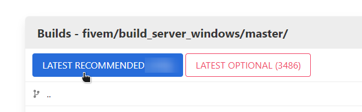

3. 打开你刚刚下载的 `server.7z` 文件。使用任何第三方解压工具（如 [7-Zip](#) 或 [WinRAR](#)）来打开 `.7z` 文件。
   
   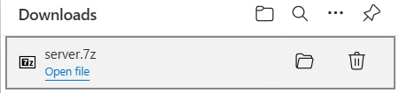

4. 将其解压到你想存储的位置。我们选择 `C:\FXServer\server`。
   
   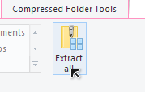
   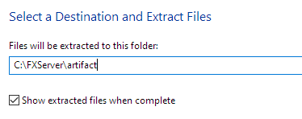

5. 打开你刚刚解压的文件夹，应该如下所示：
   
      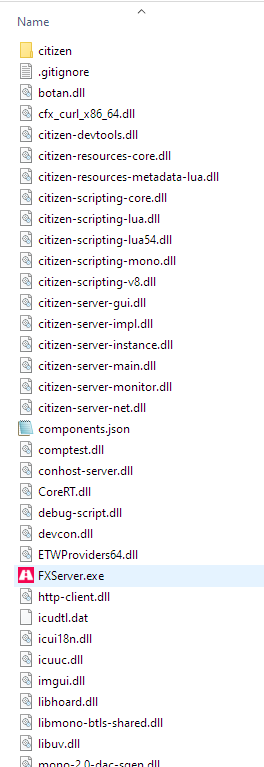

# 启动服务器

1. 双击 `FXServer.exe`。

      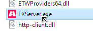

2. 此页面将会在你的浏览器中打开。确保 PIN 已经填入，然后点击“链接账户”。
   
      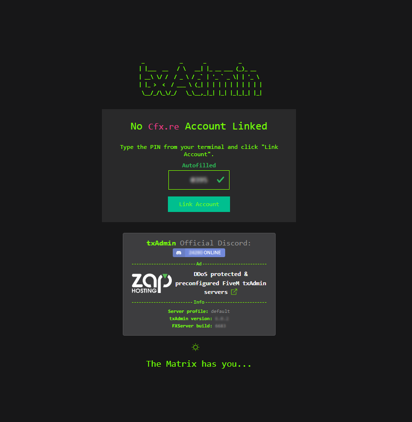

3. 在新页面中登录你的 [Cfx.re](#) 账户，然后点击 **Yes, Allow**。

      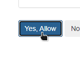

4. 创建密码以登录你的服务器管理页面。

      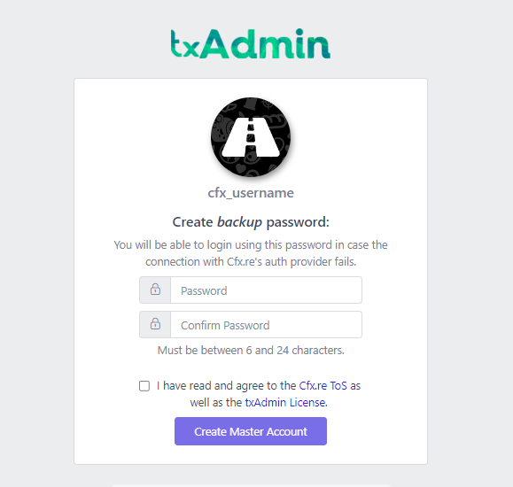

5. 点击“下一步”。

      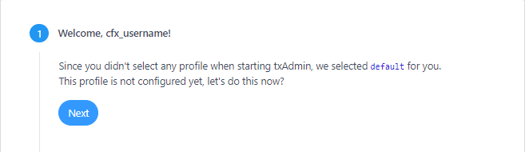

6. 输入你的服务器名称，然后点击“下一步”。
      
7. 选择“流行配方”（推荐的），用于设置服务器。

      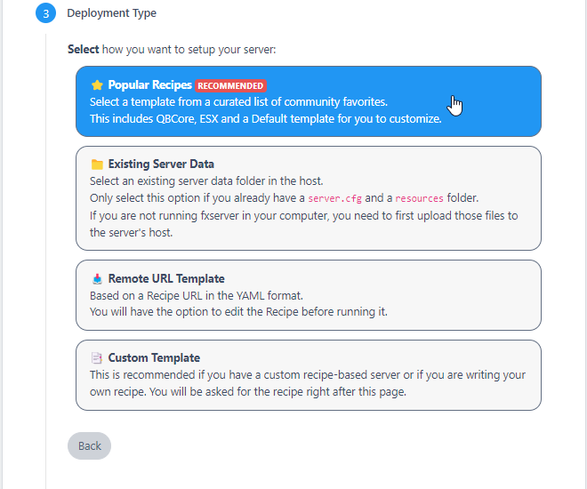

8. 选择 “CFX Default FiveM” 模板。其他模板也可能存在，但一些需要数据库服务器。

      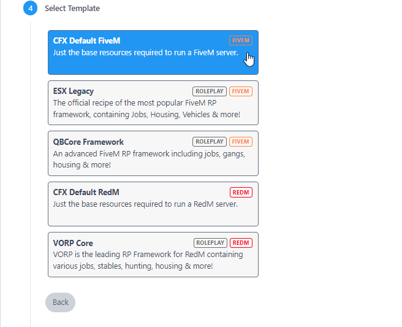

9. 点击 “保存” 或选择另一个路径。

10. 进入“配方部署者”。

      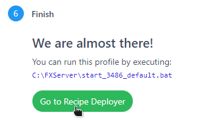

11. 确保配方正确后，点击“下一步”。

      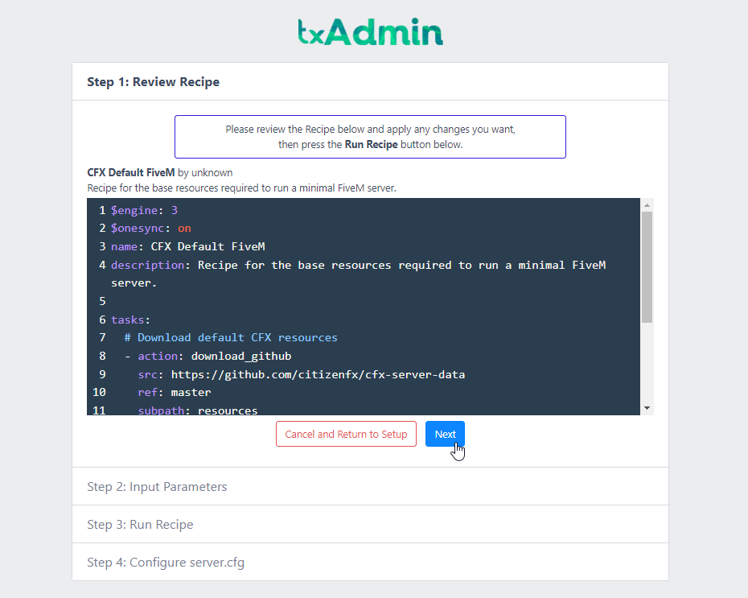
12. 在 “输入参数” 步骤中输入在 Keymaster 上生成的密钥，然后点击 “运行配方”。

    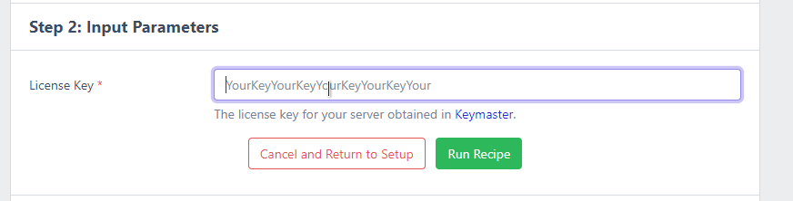
13. 如果一切正常，再次点击“下一步”。

14. 最后，点击 “保存并运行服务器”，你就完成了！
      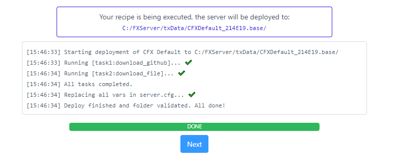
