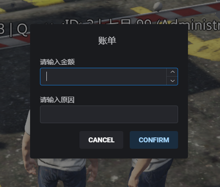
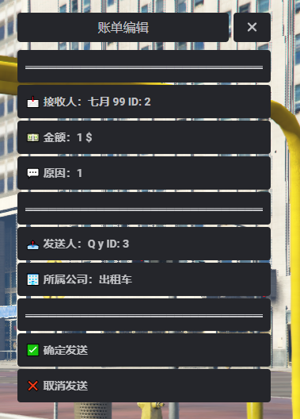
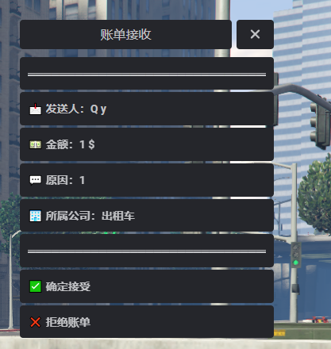
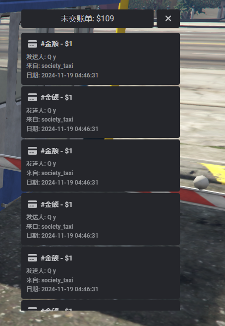
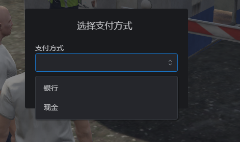

# Qy_Billing Esx账单系统

### || 框架: Esx ||

### || 展示图 ||






### || 配置示例 ||

```lua
Config = {}

Config.Key = 168 --查询自身账单 F7

Config.QdKey = true --打开或者关闭 玩家开账单系统
Config.OpenKey = 167 --给玩家开账单 F6

--允许开账单的职业
Config.Jobs = {'police', 'ambulance', 'mechanic', 'taxi'}

--打开事件     TriggerEvent('Qy_Billing:发送账单')
```

### || 记录配置 ||

```lua
RegisterServerEvent('Qy_Billing:账单给予-Logs记录')
AddEventHandler('Qy_Billing:账单给予-Logs记录', function(xPlayer1, amount, reason)
	local xPlayer = ESX.GetPlayerFromId(xPlayer1.id)
	local xTarget = ESX.GetPlayerFromId(xPlayer1.idt)

    print('玩家'..xPlayer.getName() ..'给 '.. xTarget.getName() .. '发送了 账单 金额:' .. amount .. '所属公司' .. xPlayer1.job .. '原因:' ..reason)
end)

RegisterServerEvent('Qy_Billing:账单提交-Logs记录')
AddEventHandler('Qy_Billing:账单提交-Logs记录', function(source, billId, amount, account, type)
	local xPlayer = ESX.GetPlayerFromId(source)
	print('玩家'..xPlayer.getName()..'提交账单'..amount..'账单编号:'..billId..'所属公司'..account..'货币支付'..type)
end)
```