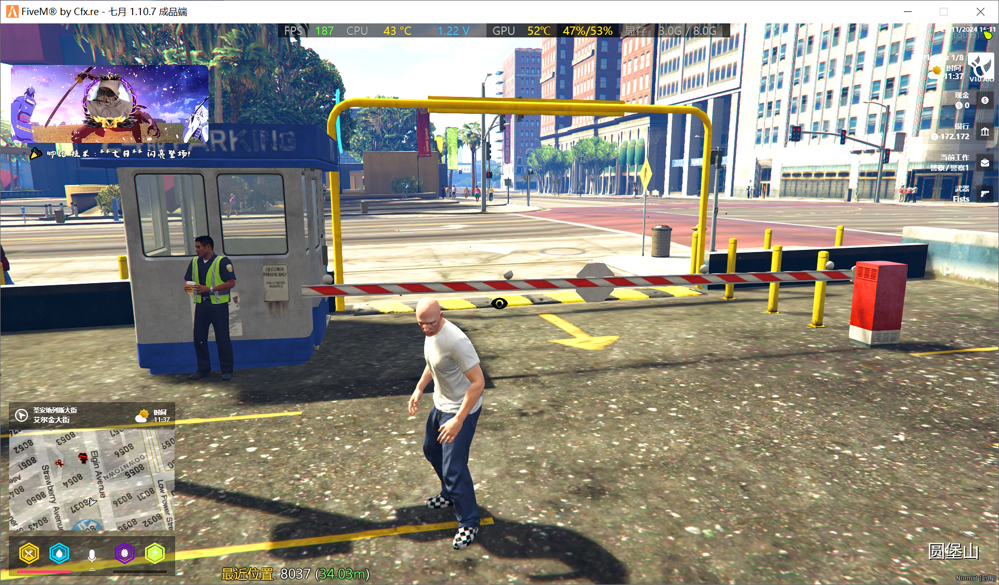

# Qy_Enter Vip进服 提示

### || 框架: Qb | Esx ||

### || 展示图 ||


### || 配置示例 ||

```lua
Config = {}

Config.Debug = true -- 测试模式

Config.ComDebug = 'cs' --测试代码 /cs

Config.Framework = "esx" -- 框架: esx | qb

Config.Tupian = "nui://Qy_Enter/imgs/%s"

Config.Time = 5000 -- 提示显示时间（毫秒 5000毫秒 = 5秒）

Config.Position = 'left' -- 位置: left | top | right | bottom

Config.PositionMap = {
    ['left'] = {
        {
            left = 0,
            top = 0
        },
        'translateX(-100%)',
        'translateX(0)'
    },
    ['top'] = {
        {
            left = '50%',
            top = '-60px'
        },
        'translate(-50%, -100%)',
        'translate(-50%, 0)'
    },
    ['right'] = {
        {
            right = '0',
            top = 0
        },
        'translateX(100%)',
        'translateX(0)'
    },
    ['bottom'] = {
        {
            left = '50%',
            bottom = 0
        },
        'translate(-50%, 100%)',
        'translate(-50%, 40px)'
    }
}

Config.VIP_Players = {
    ["char1:5c863aefdeb074e3a0cd7baf10abc539264618a4"] = {
        name = "七月",
        text = '🎉 帅比 技术 : **%s** 闪亮登场!',
        bgImg = "join-1.gif",
        Imgs = "sb.jpg",
    }
}
```