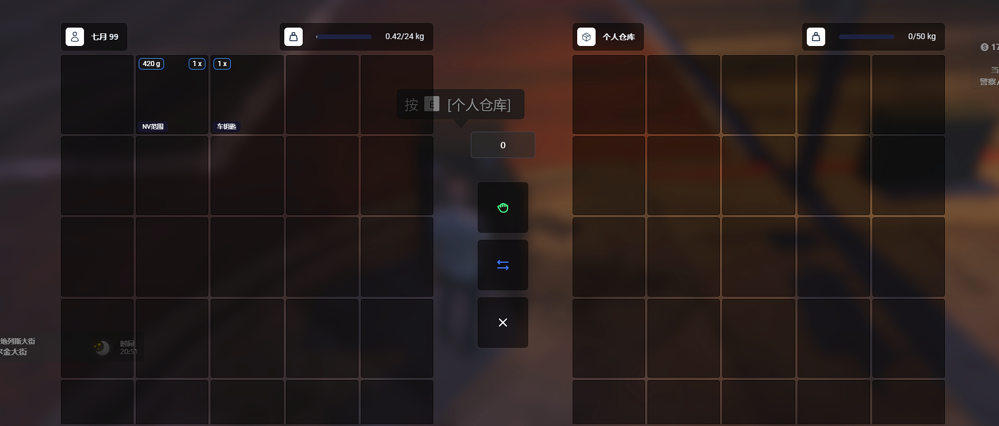

# Qy_Store Ox库存自定义仓库系统 

### || 框架: Esx ||

### || 展示图 ||

### || 配置示例 ||

```lua
Config = {}

-- 模型设置
Config.Modes = "h4_prop_h4_safe_01b"
--  ['职业仓库']编号 唯一的
Config.Store = {
    ['职业仓库'] = {
        coords = vector4(-944.60, -2102.26, 8.30, 450),
        label = '警察仓库', 
        maxWeight = 100000,
        maxSize = 50,
        ownerType = 'job',
        ownerId = 'police',
    },
    ['个人仓库'] = {
        coords = vector4(-940.93, -2103.15, 8.30, 81),
        label = '个人仓库',
        maxWeight = 50000,
        maxSize = 30,
        ownerType = 'player',
        ownerId = 'char1:5c863aefdeb074e3a0cd7baf10abc539264618a4',
    },
}
```